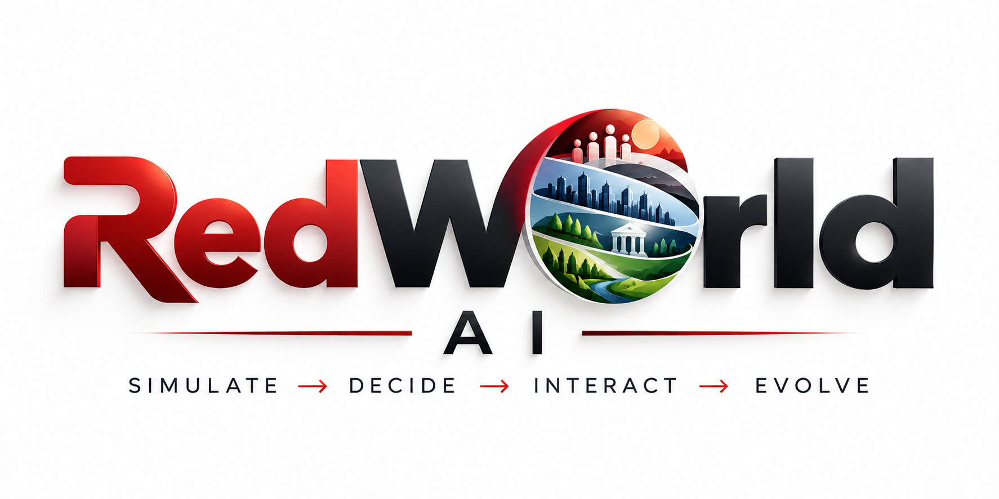

# RedWorld AI

<p align="center">
  
</p>

**SIMULATE → DECIDE → INTERACT → EVOLVE**

RedWorld AI is an autonomous society and economy simulation platform. `v0.1.0` establishes
its first deterministic closed economy and the modular financial foundation future AI agents
will inhabit.

## What v0.1.0 includes

- modular domain architecture
- double-entry accounting ledger and audit trail
- citizens and employment contracts
- payroll and citizen income
- businesses, production, inventory and consumption
- reserve-backed bank loans and repayments
- government taxation, treasury and welfare spending
- economic aggregates and unemployment metrics
- domain event history
- deterministic world ticks
- FastAPI world endpoints
- automated tests, Ruff, mypy, Docker and CI

The project deliberately does **not** claim autonomous LLM citizens yet. The next major line
will add decision-making, memory and richer world systems on top of this validated economy.

## Architecture

```text
src/redworld/
├── core/                 # cross-domain primitives/events
├── domain/entities/      # core actors
├── domains/
│   ├── accounting/
│   ├── employment/
│   ├── businesses/
│   ├── banking/
│   ├── government/
│   └── economy/
├── simulation/           # world state + orchestration
└── api/                  # external interface
```

New world systems should be added as separate domains and integrate through events, services
and ledger transactions instead of rewriting unrelated modules.

## Quick start

```powershell
py -3.14 -m venv .venv
Set-ExecutionPolicy -Scope Process -ExecutionPolicy Bypass
.\.venv\Scripts\Activate.ps1
python -m pip install --upgrade pip
python -m pip install -e ".[dev]"
python -m pytest
python -m ruff check .
python -m mypy src
```

Run the API:

```powershell
python -m uvicorn redworld.api.main:app --reload
```

Endpoints:
- `GET /api/v1/health`
- `GET /api/v1/world`
- `POST /api/v1/world/step`
- Swagger: `http://127.0.0.1:8000/docs`

## License
RedWorld AI is source-available software, not OSI open-source software. Non-commercial use
is permitted subject to the root `LICENSE`; commercial use requires separate permission.

## Current version
`v0.1.0 — First Closed Economy`
